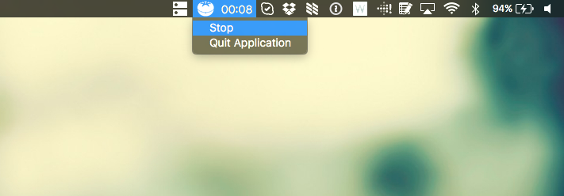

# Pomodoro App in Electron



This is a very very basic pomodoro app in electron. 

Code is subject to massive refactoring, this is mostly just a try-out project but I intend to expand on it and clean it up.

## Installation

[Download latest release](https://github.com/veloxy/pomodoro-electron/releases) and install it like any other OSX application. 😋

## Building from source

```
npm install
npm run build
```

## What's next?

- Find a good name!
- Decide if It should be kept simple or if it needs more features.

## Credits

- Pomodoro icon by José Campos from the Noun Project
- Ratchet sound from [Freesound user atomota](http://www.freesound.org/people/atomota/)
- Bell sound from [Freesound user domrodrig](http://www.freesound.org/people/domrodrig/)
