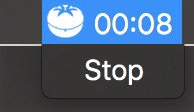

# Basic Pomodoro in Electron



This is a very very basic pomodoro app in electron. 

Code is subject to massive refactoring, this is mostly just a try-out project but I intend to expand on it and clean it up.

## Build

### OS X

```
electron-packager ./ Pomodoro --platform=darwin --arch=all --version=0.36.7 --out=./build
```

## Credits

Pomodoro icon by José Campos from the Noun Project
